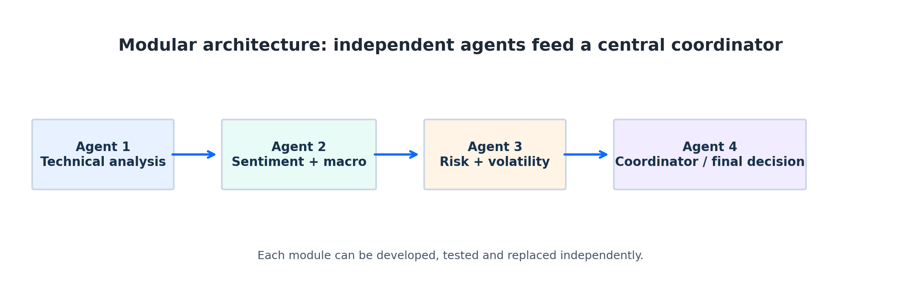
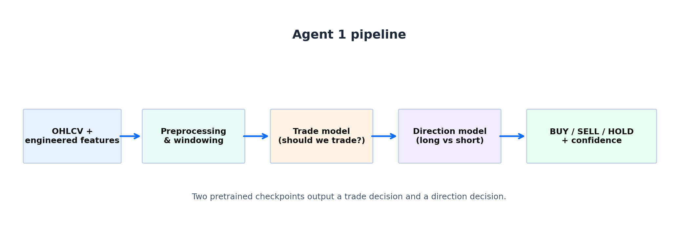
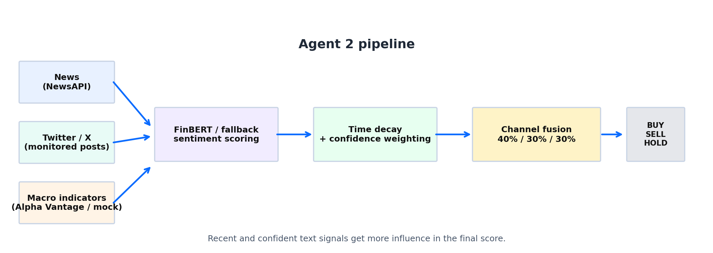
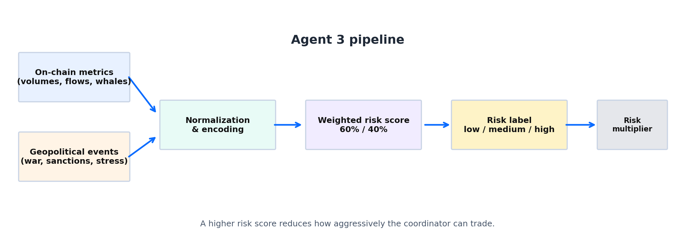
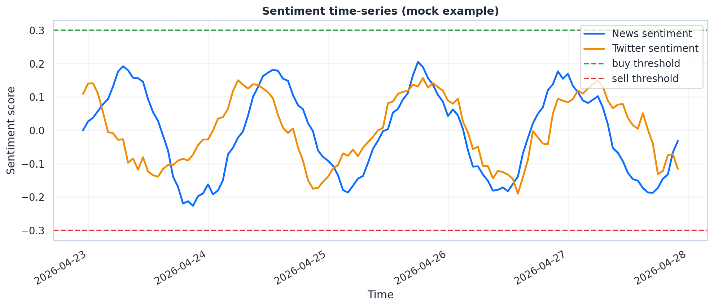
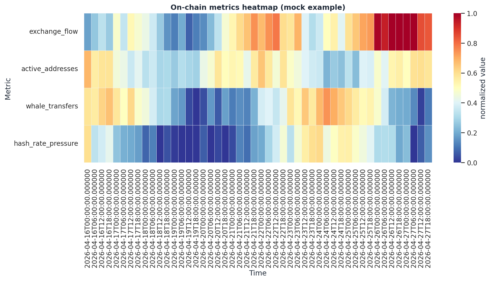

# Multi-Agent Bitcoin Trading Intelligence System — Project Report

---

## 1. Executive Overview

This document is a technical report for the Multi-Agent Bitcoin Trading Intelligence System. The system is built as a set of independent, specialized agents whose outputs are fused by a coordinator to produce an explainable trading decision (`BUY/SELL/HOLD`). The goal is to improve interpretability and robustness by separating concerns: quantitative market structure, narrative/sentiment context, and regime risk are handled by distinct modules that are easier to develop, test and maintain.

At a glance:

- **Agent 1:** technical market-structure (price + engineered features)
- **Agent 2:** sentiment and macro narrative (news, X/Twitter, macro indicators)
- **Agent 3:** risk and volatility (on-chain metrics, geopolitical events)
- **Agent 4:** coordinator that fuses the three agents and produces the final explainable signal

---

## 2. Project Goals

The system is designed to produce an explainable trading signal while combining heterogeneous inputs (price, text, macro, blockchain, events). Modularity is a primary design principle so each team member can develop and test an agent independently. The implementation supports both real-data operation and fallback/mock-mode to guarantee stable demonstrations and development reproducibility.

---

## 3. System Architecture

### 3.1 High-level flow

The runtime flow is straight-forward: each agent ingests domain-specific inputs, computes a normalized numeric score and a confidence, and returns a JSON-like payload. The coordinator then combines these payloads to produce the final trading decision.

1. `Agent 1 (Technical)` performs inference with pretrained models using `bitcoin-predictor-dev/data/processed/features_1h.parquet`.
2. `Agent 2 (Sentiment + Macro)` gathers news, monitored X/Twitter feeds and macro indicators to create a directional narrative score.
3. `Agent 3 (Risk + Volatility)` computes a regime score from on-chain metrics and geopolitical event signals.
4. `Agent 4 (Coordinator)` fuses directional conviction from Agents 1 and 2, and then modulates the result using Agent 3's risk state to obtain the final, explainable signal.

### 3.2 Modularity principle

Agents are intentionally isolated to simplify development and dependency management. The repository contains distinct folders for each agent (`coordinator_agent/`, `sentiment_analysis/`, `agent_risk/`) and the coordinator may call Agents 2 and 3 via `run_agent_json.py` subprocess bridges. This reduces cross-import issues and enforces clear I/O contracts based on JSON.

<div style="margin-top: 20px; margin-bottom: 6px;">

</div>
<p style="color:#555; font-size:0.9em; margin-top:4px;"><em>Figure: Modularity principle — agent isolation and JSON-based I/O contracts.</em></p>

---

<div style="page-break-after: always;"></div>

## 4. Agent 1 — Technical Analysis

Agent 1 is the quantitative market-structure module and the most direct signal of short-to-medium term price behavior. It uses pretrained models included in `bitcoin-predictor-dev` and performs inference on the latest feature window.

**Inputs**
The agent loads two checkpoints from `bitcoin-predictor-dev/src/models` (trade and direction models) and reads recent feature frames from `bitcoin-predictor-dev/data/processed/features_1h.parquet`.

**Method**
The pipeline reconstructs the expected input dimensions from checkpoint metadata, builds a sliding window (default 60 rows), normalizes features using stored preprocessing parameters, and runs two models:

- Trade model — binary: is a trade justified?
- Direction model — conditional: if trade is justified, probability of long vs short

**Decision logic and confidence**
The agent maps model outputs to discrete labels using clear thresholds:

<table style="border-collapse:collapse; width:100%; max-width:720px; margin: 16px 0;">
  <thead>
    <tr style="background:#0b6cff; color:#fff; text-align:left;">
      <th style="padding:8px; border:1px solid #ddd;">Condition</th>
      <th style="padding:8px; border:1px solid #ddd;">Action</th>
    </tr>
  </thead>
  <tbody>
    <tr style="background:#f7fbff;"><td style="padding:8px; border:1px solid #ddd;">trade_prob &lt; 0.55</td><td style="padding:8px; border:1px solid #ddd;">hold</td></tr>
    <tr><td style="padding:8px; border:1px solid #ddd;">trade_prob &ge; 0.55 and long_prob &ge; 0.5</td><td style="padding:8px; border:1px solid #ddd;">buy</td></tr>
    <tr style="background:#f7fbff;"><td style="padding:8px; border:1px solid #ddd;">trade_prob &ge; 0.55 and long_prob &lt; 0.5</td><td style="padding:8px; border:1px solid #ddd;">sell</td></tr>
  </tbody>
</table>

Confidence computation:

- hold: `1 - trade_prob`
- buy/sell: `trade_prob * max(long_prob, 1 - long_prob)`

**Role in fusion**
Because this agent is trained on direct market patterns, coordinator fusion gives it a higher base weight (60%) when combining directional conviction.

<div style="margin-top: 24px; margin-bottom: 6px;">

</div>
<p style="color:#555; font-size:0.9em; margin-top:4px;"><em>Figure: Technical pipeline — feature extraction from OHLCV, sliding-window assembly, normalization and dual-model inference (trade + direction).</em></p>

---

<div style="page-break-after: always;"></div>

## 5. Agent 2 — Sentiment and Macro Analysis

Agent 2 combines NLP-derived narrative signals with macroeconomic indicators to detect directional pressure that is not visible in price series alone.

**Inputs**
News (NewsAPI or fallback mock), monitored X/Twitter feeds (configurable account lists; mock fallback supported), macro indicators (Alpha Vantage when available, otherwise simulated), and market context (CoinGecko price snapshot).

**Text processing and scoring**
The agent uses `ProsusAI/finbert` for sentence-level financial sentiment. For each text item the model returns class probabilities; the per-item sentiment score is computed as `positive_prob - negative_prob` and its confidence is `max_class_prob`. When the model is unavailable or fails, a lightweight keyword-based fallback is used.

**Time weighting and aggregation**
Each item's contribution is time-decayed so that recent items have higher influence. A relevance weight is computed as `relevance = decay_function(age_hours) * confidence`. The aggregate channel score is a weighted average:

```
avg_sentiment = sum(sentiment_i * relevance_i) / sum(relevance_i)
```

**Channel fusion and thresholds**
Agent 2 fuses three channels with fixed weights:

<table style="border-collapse:collapse; width:100%; max-width:640px; margin: 16px 0;">
  <thead>
    <tr style="background:#0b6cff; color:#fff;"><th style="padding:8px; border:1px solid #ddd;">Channel</th><th style="padding:8px; border:1px solid #ddd;">Weight</th></tr>
  </thead>
  <tbody>
    <tr style="background:#f7fbff;"><td style="padding:8px; border:1px solid #ddd;">News</td><td style="padding:8px; border:1px solid #ddd; text-align:right;">0.40</td></tr>
    <tr><td style="padding:8px; border:1px solid #ddd;">Twitter/X</td><td style="padding:8px; border:1px solid #ddd; text-align:right;">0.30</td></tr>
    <tr style="background:#f7fbff;"><td style="padding:8px; border:1px solid #ddd;">Macro indicators</td><td style="padding:8px; border:1px solid #ddd; text-align:right;">0.30</td></tr>
  </tbody>
</table>

Combined-score mapping:

<table style="border-collapse:collapse; width:60%; max-width:480px; margin: 16px 0;">
  <thead>
    <tr style="background:#222; color:#fff;"><th style="padding:8px; border:1px solid #ddd;">combined_score</th><th style="padding:8px; border:1px solid #ddd;">label</th></tr>
  </thead>
  <tbody>
    <tr style="background:#f7fbff;"><td style="padding:8px; border:1px solid #ddd;">&gt; +0.30</td><td style="padding:8px; border:1px solid #ddd;">buy</td></tr>
    <tr><td style="padding:8px; border:1px solid #ddd;">&lt; -0.30</td><td style="padding:8px; border:1px solid #ddd;">sell</td></tr>
    <tr style="background:#f7fbff;"><td style="padding:8px; border:1px solid #ddd;">otherwise</td><td style="padding:8px; border:1px solid #ddd;">hold</td></tr>
  </tbody>
</table>

**Visual explanation**
The figure below illustrates how individual article and tweet scores are weighted by recency and confidence, then combined into per-channel averages and fused into the final `combined_score`.

<div style="margin-top: 24px; margin-bottom: 6px;">

</div>
<p style="color:#555; font-size:0.9em; margin-top:4px;"><em>Figure: Sentiment pipeline — per-item scoring, time decay, channel aggregation and channel fusion.</em></p>

---

<div style="page-break-after: always;"></div>

## 6. Agent 3 — Risk and Volatility Analysis

Agent 3 evaluates market regimes and instability indicators and therefore acts as a safety layer. It does not directly predict direction; rather it provides a multiplier that increases or reduces coordinator aggression.

**Inputs and pre-processing**
Typical on-chain signals include exchange inflows/outflows, active addresses, large transfers (whale activity), and hash-rate/mempool state. Geopolitical input is event-based (war, sanctions, political instability) and is mapped to a simple numeric stress value.

**Scoring and thresholds**
Agent 3 combines normalized on-chain and geopolitical stress signals:

<div style="max-width:720px; margin: 16px 0;">
<pre style="background:#f6f8fb; padding:10px; border-left:4px solid #0b6cff; overflow:auto;">combined_risk = 0.60 * onchain_risk + 0.40 * geopolitical_risk
(each component normalized to [0,1])</pre>
</div>

Risk label mapping:

<table style="border-collapse:collapse; width:60%; max-width:480px; margin: 16px 0;">
  <thead>
    <tr style="background:#0b6cff; color:#fff;"><th style="padding:8px; border:1px solid #ddd;">combined_risk</th><th style="padding:8px; border:1px solid #ddd;">label</th></tr>
  </thead>
  <tbody>
    <tr style="background:#f7fbff;"><td style="padding:8px; border:1px solid #ddd;">&lt; 0.30</td><td style="padding:8px; border:1px solid #ddd;">low_risk</td></tr>
    <tr><td style="padding:8px; border:1px solid #ddd;">0.30 – 0.70</td><td style="padding:8px; border:1px solid #ddd;">medium_risk</td></tr>
    <tr style="background:#f7fbff;"><td style="padding:8px; border:1px solid #ddd;">&gt; 0.70</td><td style="padding:8px; border:1px solid #ddd;">high_risk</td></tr>
  </tbody>
</table>

<div style="margin-top: 24px; margin-bottom: 6px;">

</div>
<p style="color:#555; font-size:0.9em; margin-top:4px;"><em>Figure: Risk pipeline — normalisation of on-chain signals and encoding of geopolitical events, combined into a regime score.</em></p>

**Confidence**
Agent confidence scales with data coverage (on-chain metrics completeness and event metadata richness). The final coordinator uses risk confidence to temper how strongly the risk multiplier is applied.

**Why it matters**
The coordinator uses Agent 3 to avoid trading during dangerous regimes. For example, a strong buy signal from Agents 1 and 2 can be dampened or gated to `hold` if Agent 3 reports `high_risk`.

---

<div style="page-break-after: always;"></div>

## 7. Agent 4 — Coordinator and Final Decision

The coordinator ingests standardized payloads from all agents, performs a weighted fusion of directional conviction, applies a risk-based multiplier, and produces an explainable output.

**Integration pattern**
`Agent 1` is typically invoked directly in-process (`TechnicalAgent.run()`), while `Agent 2` and `Agent 3` are invoked through `run_agent_json.py` subprocess wrappers to preserve dependency isolation.

**Fusion algorithm**

1. Map labels to numeric scores: `buy=+1`, `hold=0`, `sell=-1`.
2. Multiply each numeric score by the respective agent confidence.
3. Compute directional fusion: `combined_score = 0.60 * tech_score + 0.40 * sentiment_score`.
4. Apply risk multiplier based on Agent 3 label:

<table style="border-collapse:collapse; width:420px; margin: 16px 0;">
  <thead>
    <tr style="background:#0b6cff; color:#fff;"><th style="padding:8px; border:1px solid #ddd;">risk label</th><th style="padding:8px; border:1px solid #ddd;">multiplier</th></tr>
  </thead>
  <tbody>
    <tr style="background:#f7fbff;"><td style="padding:8px; border:1px solid #ddd;">low_risk</td><td style="padding:8px; border:1px solid #ddd; text-align:right;">1.10</td></tr>
    <tr><td style="padding:8px; border:1px solid #ddd;">medium_risk</td><td style="padding:8px; border:1px solid #ddd; text-align:right;">1.00</td></tr>
    <tr style="background:#f7fbff;"><td style="padding:8px; border:1px solid #ddd;">high_risk</td><td style="padding:8px; border:1px solid #ddd; text-align:right;">0.65</td></tr>
  </tbody>
</table>

5. Clamp the adjusted score to `[-1, +1]`.
6. Convert numeric score to discrete action:
   - `adjusted_score >= +0.25` → **BUY**
   - `adjusted_score <= -0.25` → **SELL**
   - otherwise → **HOLD**

Final confidence is computed as `min(1.0, abs(adjusted_score) + 0.15 * risk_confidence)` and the coordinator returns a human-readable reasoning paragraph and key factor summary to aid explainability.

<div style="margin-top: 24px; margin-bottom: 6px;">

</div>
<p style="color:#555; font-size:0.9em; margin-top:4px;"><em>Figure: Multi-agent flow — end-to-end signal fusion across all four agents.</em></p>

---

<div style="page-break-after: always;"></div>

## 8. How the Final Result is Obtained — End-to-End

The pipeline follows a simple contract: each agent returns a JSON-like payload `{label, score, confidence, details}`. The coordinator consumes these payloads and performs the fusion steps described above. The final output contains the discrete action, a numeric conviction, the risk label and a short natural-language explanation assembled from the `details` fields provided by agents.

**Summary flow:**

- Agents convert raw inputs to normalized scores and confidences.
- Coordinator fuses directional agents, then modulates by risk.
- Thresholds map the numeric result to `BUY/SELL/HOLD` and the reportable confidence.

---

## 9. What Affects the Result Most

Primary drivers are the technical model probabilities, the balance of sentiment channels, and the risk multiplier. The fusion thresholds and agent weights are sensitive parameters — small changes can flip marginal cases.

**Sensitivity checklist:**

- hard-coded thresholds (`trade_prob`, `long_prob`, `combined_score` cutoffs)
- freshness and completeness of API feeds (news, macro, on-chain)
- feature alignment for Agent 1 (preprocessing must match checkpoint expectations)
- quality of event labeling for geopolitical inputs

**Examples of inter-agent influence:**

- A high-confidence `buy` from Agent 1 combined with neutral sentiment will likely stay `buy` because technical weight is 60%.
- Strong negative narrative from Agent 2 can overcome weak technical bullish signals and push the coordinator toward `hold` or `sell`.
- Agent 3 can force a conservative gate: `high_risk` may reduce an otherwise strong buy to `hold` to avoid exposure.

---

## 10. Real Data vs Mock Data Behaviour

The codebase supports a dual-mode operation: real-data mode (uses NewsAPI, AlphaVantage, Twitter/X) and mock-mode (controlled, repeatable fake data). Mock-mode guarantees reproducible demos and protects the pipeline from external API rate limits or missing credentials. For final evaluation and live operation, real-data mode is recommended — but note that some APIs have paid tiers and rate limits.

---

## 11. Reliability, Error Handling and Safety Defaults

Each agent implements defensive programming patterns. On exceptions the agent returns safe defaults (`hold` for direction, `medium_risk` for risk) and includes an `error` field in the details. The coordinator validates subprocess exit codes and JSON payloads, and will use defaults if a payload is missing or malformed. These behaviors are critical for stable demonstrations and for initial integration testing.

---

<div style="page-break-after: always;"></div>

## 12. Current Limitations

The main limitations are:

1. Fusion weights are heuristic and require systematic calibration via backtesting.
2. External API availability and rate limits — advanced features of NewsAPI/AlphaVantage/Twitter may be paid.
3. NLP and event extraction can be noisy; noisy labels lead to biased narrative scores.
4. Agent 1 depends on exact feature schema compatibility with the pretrained checkpoints.

---

## 13. Validation and Evaluation Strategy

We currently run unit-level checks and end-to-end smoke tests. For a rigorous evaluation we recommend:

1. Historical backtest where snapshots of news/X/macro/on-chain at each historical timestamp are synchronized so each agent sees only past information.
2. Ablation experiments: remove or silence an agent and measure performance delta.
3. Grid search or Bayesian optimization over fusion weights and thresholds using walk-forward validation.
4. Regime-specific performance analysis (high volatility, low liquidity, geopolitical stress).

---

## 14. Why Multi-Agent is a Good Design Choice

Modularity enables clearer ownership, easier debugging and explainability. Agents can be upgraded independently and new data sources can be added without retraining a single monolithic model.

---

## 15. Conclusion

The project implements a practical, explainable multi-agent architecture where quantitative, narrative and regime signals combine to produce robust trading support. Agent specialization encourages focused validation and clearer explanations of why a trade was recommended.

**Key takeaway:** the final decision quality depends on complementary signals — technical patterns (Agent 1), narrative pressure (Agent 2) and conservative gating by the risk module (Agent 3) — all merged by a transparent coordinator.

---

<div style="page-break-after: always;"></div>

## Appendix A — Key Project Paths

- `bitcoin-predictor-dev/src/models/direction/best_model.pt`
- `bitcoin-predictor-dev/src/models/trade/best_model.pt`
- `bitcoin-predictor-dev/data/processed/features_1h.parquet`
- `sentiment_analysis/sentiment_agent.py`
- `sentiment_analysis/sentiment_analyzer.py`
- `agent_risk/risk_agent.py`
- `coordinator_agent/technical_agent.py`
- `coordinator_agent/coordinator_agent.py`

---

## Appendix B — Related Presentation Files

- `Presentation/01_Agent1_Technical_Analysis.md`
- `Presentation/02_Agent2_Sentiment_Macro.md`
- `Presentation/03_Agent3_Risk_Volatility.md`
- `Presentation/04_Agent4_Coordinator.md`

---

<div style="page-break-after: always;"></div>

## Appendix C — Sample Analysis Graphs

### 1) Sentiment time-series (news + Twitter combined)

<div style="margin-top: 20px; margin-bottom: 6px;">

</div>

**What this plot shows**
This time-series plot overlays the aggregated News sentiment and Twitter sentiment channels over a selectable period (hourly aggregation in the sample). The dashed horizontal lines mark the `+0.30` and `-0.30` thresholds used by Agent 2 to translate numeric combined scores into `buy` / `sell` decisions. Observing how channels cross thresholds (and whether crossings are sustained) helps you judge whether narrative pressure supports a trade or is merely a short spike.

**Why it matters**

- Confirms whether narrative momentum is transient or persistent
- Helps correlate narrative shifts with price moves (when used alongside Agent 1 outputs)

**How it is produced**
The plotted series are produced by per-item sentiment scoring (FinBERT outputs) followed by time decay weighting and hourly aggregation. See Appendix C code snippet 1 for the exact resampling and plotting steps.

---

### 2) Risk heatmap (on-chain metrics over time)

<div style="margin-top: 20px; margin-bottom: 6px;">

</div>

**What this plot shows**
The heatmap displays several normalized on-chain metrics (for example: exchange inflows, active addresses, large transfers) on the vertical axis and time on the horizontal axis. Color intensity corresponds to normalized metric magnitude. Synchronous spikes across multiple metrics signal regime stress that typically raises the `combined_risk` value.

**Why it matters**

- Allows quick visual detection of co-movement in on-chain stress signals
- Visualises when multiple risk indicators align, which often precedes volatility spikes

**How it is produced**
Each raw metric is normalized (e.g., min-max or z-score), resampled to 6-hour bins and then arranged as a matrix for the heatmap. The plotting snippet in Appendix C snippet 2 reproduces this process (using `seaborn.heatmap`).